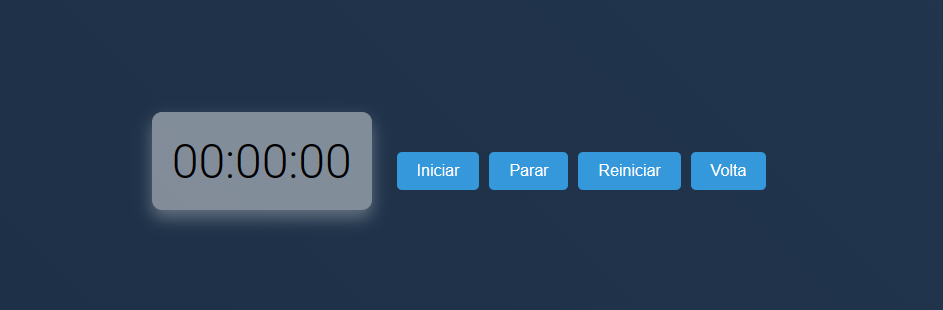

# Cronômetro Futurístico

Um cronômetro interativo com um design futurístico e várias funcionalidades. Acompanhe o tempo e registre voltas com estilo usando este cronômetro desenvolvido em HTML, CSS e JavaScript.

## Demonstração

## Recursos

- Iniciar, parar e reiniciar o cronômetro.
- Registrar voltas durante a contagem do tempo.
- Design moderno e futurístico.
- Fundo interativo e sombra realista.
- Fonte estilizada para uma aparência única.

## Como Usar

1. Clone este repositório para o seu computador.
2. Abra o arquivo `index.html` em um navegador da web.
3. Use os botões para controlar o cronômetro e registrar voltas conforme necessário.

## Personalização

Você pode personalizar este cronômetro de acordo com suas preferências:

- Altere a fonte, cores e estilos no arquivo CSS.
- Adicione ou remova funcionalidades no código JavaScript.
- Ajuste a aparência geral para se adequar ao seu gosto.

## Licença

Este projeto está licenciado sob a Licença MIT - veja o arquivo [LICENSE](LICENSE) para mais detalhes.

---

Feito com 💙 por [ffrrilli](https://github.com/ffrrilli).
